# Projeto DimDim App

Este repositório contém um ambiente Docker com dois containers:

-   **db**: PostgreSQL com volume nomeado para persistência de dados.
-   **app**: API Node.js com Express e PostgreSQL, rodando como usuário não-root.

## Requisitos

-   Docker e Docker Compose instalados.
-   Acesso a um terminal (Linux, macOS, Windows WSL).

## Passo a passo com imagens

### 1. Clonar o repositório

```bash
git clone https://github.com/viniciusdurce/cp3devops.git
cd cp3devops
```

### 2. Build e subida dos containers

Execute no diretório raiz:

```bash
docker-compose up -d --build
```

Você irá receber um output como esse no final:
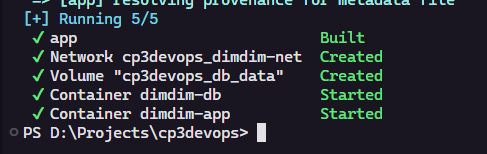

Isto irá criar e iniciar dois containers:

-   `dimdim-db` (PostgreSQL)
-   `dimdim-app` (API Node.js)

Vamos verificar com:

```bash
docker ps
```

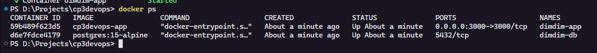

### 3. Testando a API

## Rotas disponíveis

| Método | Endpoint     | Descrição               |
| ------ | ------------ | ----------------------- |
| GET    | `/`          | Health check            |
| GET    | `/users`     | Lista todos os usuários |
| POST   | `/users`     | Cria um usuário         |
| PUT    | `/users/:id` | Atualiza usuário por ID |
| DELETE | `/users/:id` | Deleta usuário por ID   |

Agora vamos partir para os testes!

-   **Health check**
    Primeiro iremos realizar um "health check". Abra o seu api tester e cole a seguinte url:

        ```bash
        http://localhost:3000/
        # Utilizie o método GET

        ```

    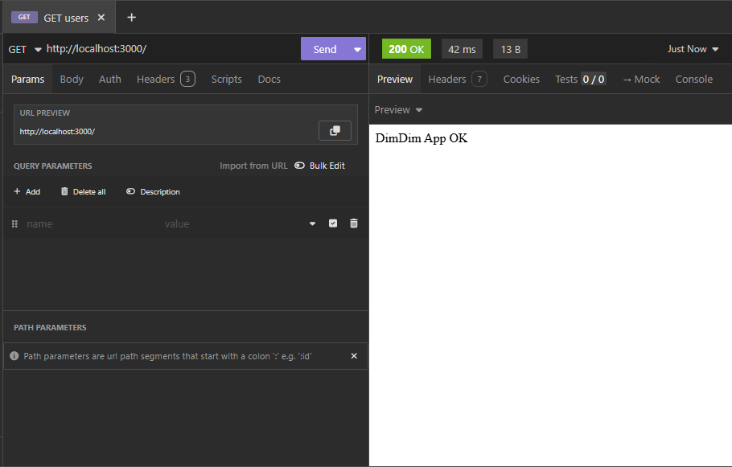

    > Deve retornar um "DimDim App OK" como na imagem.

-   **CRUD na rota /users**

    -   **Criar**: Vamos testar a api de fato. Estaremos criando um usuário com o nome "Vinicius"

        ```bash
        http://localhost:3000/users # Utilize o método POST

        {
            "name": "Vinicius"
        }

        ```

    -   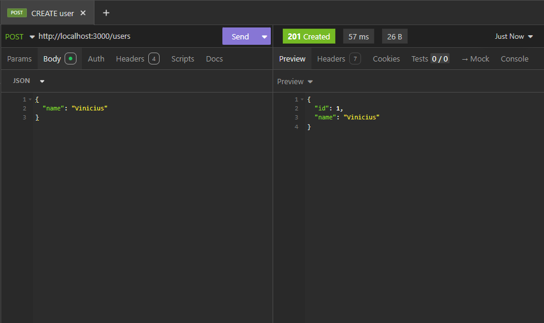

    -   **Listar**: Agora que criamos um usuario podemos listar ele

        ```bash
        http://localhost:3000/users # Utilize o método GET
        ```

    -   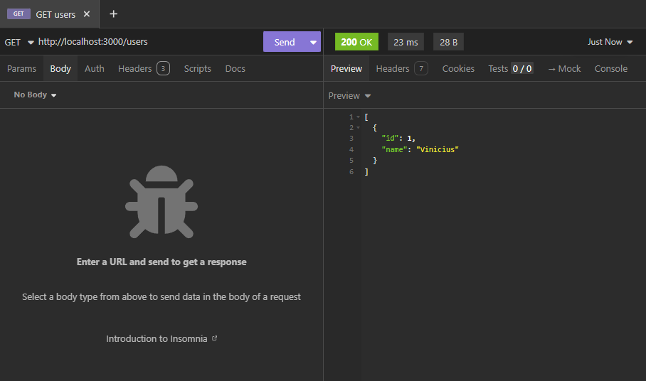

    -   **Atualizar**:

        ```bash
        http://localhost:3000/users/1 # Utilize o método PUT

        {
            "name": "Vinicius Durce"
        }
        # Não se esqueça de colocar o id do usuario na url

        ```

    -   Deve retornar status 200 OK
        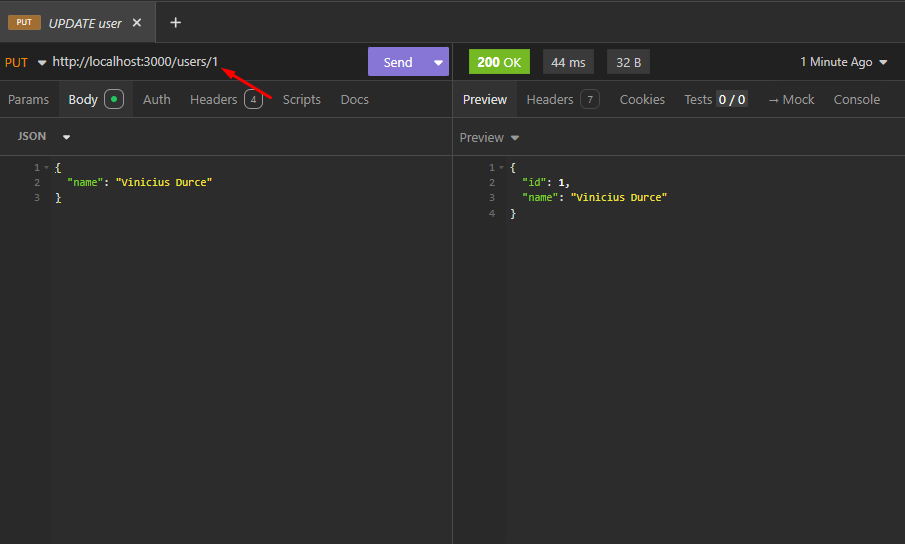

    -   **Deletar**: E agora para deletar é só colocar o id do usuario que deseja deletar ao fim da url (no nosso caso é o 1)

            ```bash
            http://localhost:3000/users/1 # Utilize o método DELETE
            ```

        Deve retornar 204 No Content:
        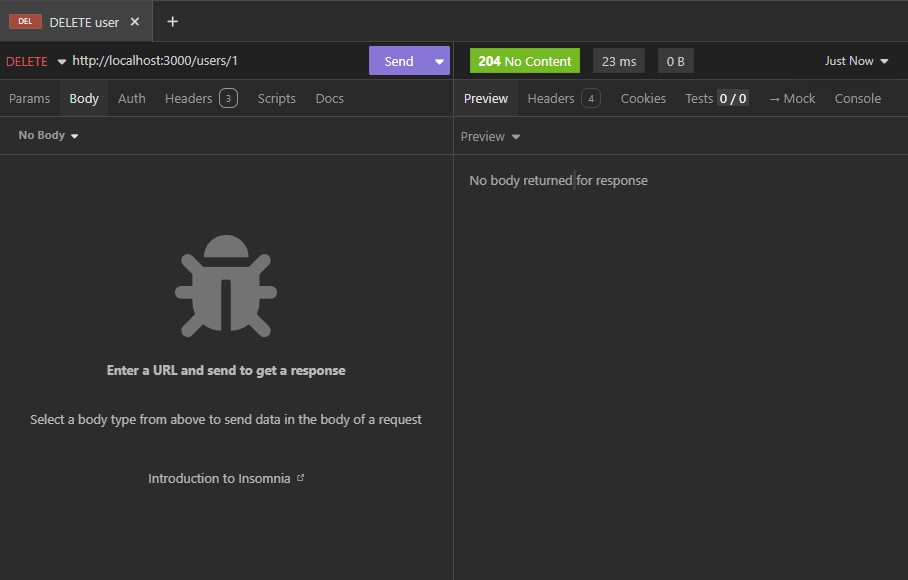
        E agora vamos visualizar os nossos usuarios pra ver se deu certo mesmo (adicionei mais alguns só pra não ficar tão vazio)
        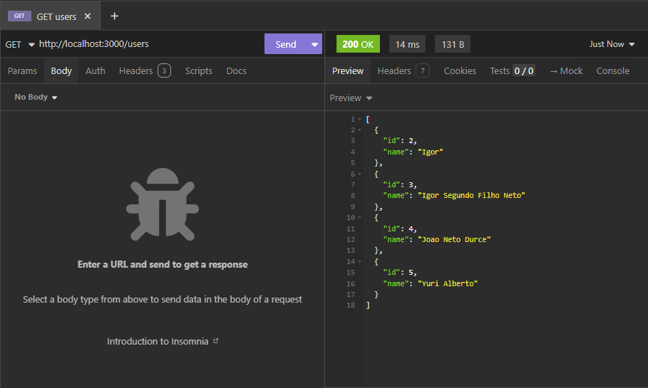

        > Podemos ver que o usuario 1 (Vinicius Durce) foi excluido com sucesso!

### 4. Validando persistência de dados

Primeiro vamos consultar os registros presentes no banco

1. Vamos acessar o psql dentro do container do DB:

    ```bash
    docker exec -it dimdim-db psql -U dimdim_user -d dimdim
    ```

2. Listar as tabelas:

    ```sql
    \dt
    ```

3. Consultar os registros:

    ```sql
    SELECT * FROM users;
    ```

4. Você deve receber um retorno como esse:
   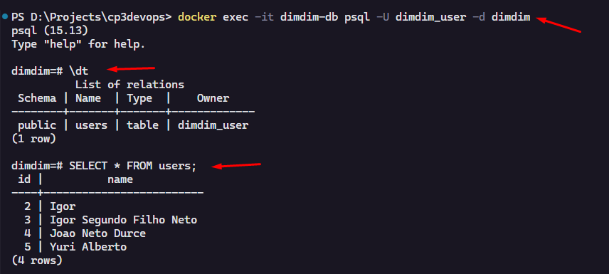
5. Saindo do psql:

    ```sql
    \q
    ```

6. Agora vamos parar e subir novamente os containers (mantendo o volume):

    ```bash
    docker-compose down
    docker-compose up -d
    ```

7. Entrando novamente no psql verificamos que os mesmos dados ainda existem!!
   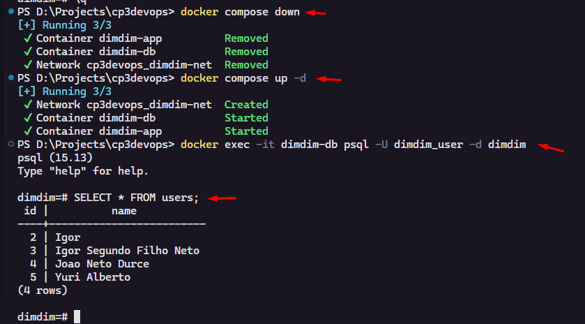

### 5. Inspeção dos containers

Vamos inspecionar os containers por dentro, a começar pelo app

#### 5.1 Container da aplicação

```bash
docker exec -it dimdim-app sh # Deve entrar como appuser

/usr/src/app$ pwd
/usr/src/app$ ls
/usr/src/app$ whoami
exit
```

Voce deve receber um retorno como esse:
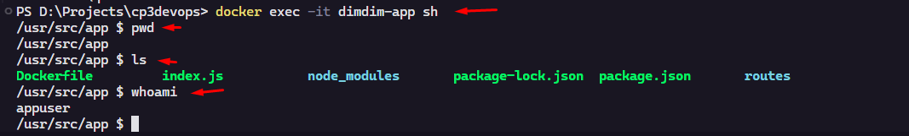

#### 5.2 Container do banco

    ```bash
    docker exec -it dimdim-db sh

    whoami # → root
    ls  # → bin  etc  var …
    pwd

    ```

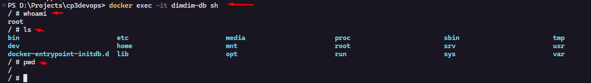

> Por padrão, o container do banco com o Shell vai rodar como root, mas o próprio serviço do PostgreSQL continua rodando como usuário postgres normalmente.

## 🤝 Grupo

<table>
  <tr>
    <td align="center">
      <a href="https://github.com/nichol6s">
        <br>
        <sub>
          <strong>Igor Ribeiro RM550989</strong>
        </sub>
      </a>
    </td>
    <td align="center">
      <a href="https://github.com/VitorKubica">
        <br>
        <sub>
          <strong>Vinicius Durce RM550427</strong>
        </sub>
      </a>
    </td>
   <tr>
</table>
